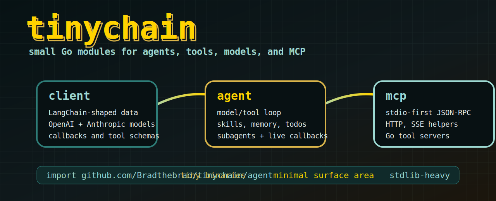

# tinychain



`tinychain` is a tiny set of Go modules for building LangChain-shaped clients, agents, skills, tools, and MCP-style tool servers without dragging a whole ecosystem into your binary.

It is intentionally boring in the best way: small structs, explicit interfaces, stdlib-first networking, and just enough agent loop to build real local apps like NullBot.

## Modules

| Module | Import path | Purpose |
| --- | --- | --- |
| `client` | `tinychain` | LangChain-shaped message/data models, callbacks, OpenAI request/response models, Anthropic request/response models, and tiny provider clients. |
| `agent` | `tinychain/agent` | Minimal model/tool loop with skills, memory prompt injection, todo planning, subagent task delegation, and callback events. |
| `mcp` | `tinychain/mcp` | Minimal MCP-style JSON-RPC protocol, stdio-first server/client transport, HTTP/SSE helpers, and adapters that expose MCP tools to agents. |

Each layer has its own `go.mod`, so consumers can import only the piece they need.

## Design Goals

| Goal | What that means here |
| --- | --- |
| Tiny binaries | No framework pileup, no giant runtime, no reflection-heavy abstraction maze. |
| LangChain-shaped data | Familiar message, content, tool-call, generation, and callback models in Go structs. |
| Provider escape hatches | OpenAI and Anthropic request/response shapes are represented directly; OpenAI-compatible base URLs can be supplied by callers. |
| Explicit tools | Tools are plain Go interfaces and functions with JSON-schema-ish definitions. |
| Skills as files | `SKILL.md` files can be loaded into the agent prompt without making skills a complex plugin system. |
| MCP first, but minimal | Stdio is the default transport; HTTP/SSE style transports are available for servers that need them. |

## Client

The `client` module contains the data models and provider clients:

| Package | What it includes |
| --- | --- |
| `lc` | `BaseMessage`, content blocks, tool calls, tool definitions, generations, and helper constructors. |
| `callbacks` | LangChain-like activity events for chat model start/end/error and tool start/end/error. |
| `openai` | Chat Completions and Responses API request/response structs plus a tiny HTTP client. |
| `anthropic` | Anthropic Messages request/response structs plus a tiny HTTP client. |

The OpenAI client defaults to `https://api.openai.com/v1`, but `BaseURL` is configurable for OpenAI-compatible providers.

## Agent

The `agent` module is the smallest useful agent loop:

```go
package main

import (
	"context"
	"fmt"

	"tinychain/agent"
)

func main() {
	echo := agent.ToolFunc{
		Name:        "echo",
		Description: "Echo input back to the model.",
		Schema:      agent.ToolSchema(map[string]any{"text": agent.StringProperty("Text to echo.")}, "text"),
		Func: func(ctx context.Context, args map[string]any) (string, error) {
			return fmt.Sprint(args["text"]), nil
		},
	}

	a := agent.New(agent.Config{
		Model:        myModel{},
		SystemPrompt: "You are concise.",
		Tools:        []agent.Tool{echo},
	})

	result, err := a.Invoke(context.Background(), "say hello")
	if err != nil {
		panic(err)
	}
	fmt.Println(result.Output.Text())
}
```

In the example above, `myModel` is any type that implements `agent.Model`.

Agent features include:

| Feature | Detail |
| --- | --- |
| Tool loop | Calls a model, executes requested tools, appends tool results, repeats until final output or max iterations. |
| Built-in todo tool | Includes `write_todos` for lightweight planning state. |
| Skills | Loads `SKILL.md` instructions and composes them into the system prompt. |
| Memory | Injects compact memory snippets into the system prompt. |
| Subagents | Adds a task tool when subagents are configured, so a supervising agent can delegate focused work. |
| Callbacks | Emits model/tool start, end, and error events suitable for live UIs and logs. |

## MCP

The `mcp` module is for small tool binaries and local tool marketplaces:

| Capability | Detail |
| --- | --- |
| Stdio by default | Build command-line MCP servers that speak JSON-RPC over stdin/stdout. |
| HTTP/SSE helpers | Run or connect over stream-oriented HTTP transports when stdio is not enough. |
| Server API | Register tools as Go functions with names, descriptions, schemas, and handlers. |
| Client API | Connect to a server, list tools, and call tools. |
| Agent adapter | Convert MCP tools into `agent.Tool` values so agents can use external servers. |

This is intentionally not a full MCP kitchen sink. It is the smallest practical base for Go tool servers that can be compiled and dropped into another app.

## Repository Layout

```text
tinychain/
  assets/
    tinychain-hero.svg
  client/
    anthropic/
    callbacks/
    lc/
    openai/
  agent/
  mcp/
```

## Tests

Run module tests individually:

```powershell
cd client
go test ./...

cd ../agent
go test ./...

cd ../mcp
go test ./...
```

## Non-Goals

`tinychain` is not trying to be a complete LangChain port, a hosted model registry, a heavyweight graph runtime, or a batteries-included coding agent. The point is the opposite: keep the core tiny and let applications compose only the pieces they actually want.
